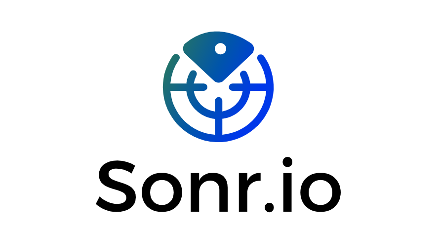
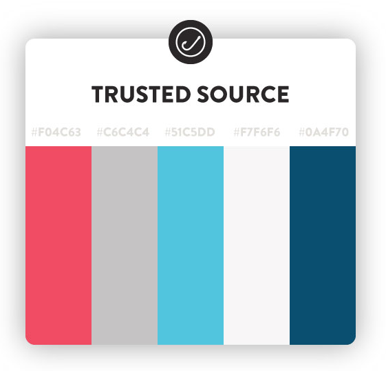

    
   

# Description
> Share anything to everyone and everything.

App utilizes Libp2p, QUIC, and OLC to be able to send any file to a nearby person. Also has robust contact sharing feature.

## Who is this for?
Anyone with multiple devices not running in the same ecosystem.

# Discovery
Peer Discovery Protocols in Sonr
## Ultrasonic
- https://www.electronicdesign.com/industrial-automation/article/21808186/sending-data-over-sound-how-and-why
- https://cueaudio.com/documents/16/cue-technical-overview.pdf
-  https://cueaudio.com/data-over-sound/
- https://stackoverflow.com/questions/20153280/android-transmit-a-signal-using-ultrasound

# Colors

    
   

### Strategy
- Add slide to Send Feature to increase volume
- Flutter Audio as Stream: https://pub.dev/packages/sound_stream
- Implement Audio Filter: https://stackoverflow.com/questions/28291582/implementing-a-high-pass-filter-to-an-audio-signal
- Audio Watermark: http://mattmontag.com/audio-listening-test/
- Utilize library for encoding: https://pub.dev/packages/flutter_ffmpeg

Offline P2P File Sharing:
- Send Files as chunk with sound, warn user slow transfer speeds
- Implement Dual Diagonal Infusion

## BLE
*TODO*
## MDNS
*TODO*

# Technologies
* [Flutter](https://github.com/flutter/flutter)
* [LibP2P](https://github.com/libp2p/go-libp2p)
* [OLC](https://github.com/google/open-location-code)
* [WebRTC](https://webrtc.org/)
* [LiquidCore](https://github.com/LiquidPlayer/LiquidCore)
* [GUN](https://gun.eco/)

# Contributors and Maintainers
- [Prad Nukala](https://prad.dev)
